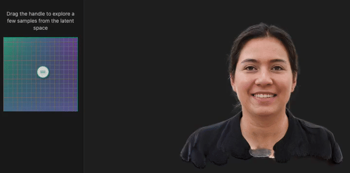

# latent-viewer

latent-viewer is browser viewer for sets of 3D Gaussian Splatting scenes. The user can explore hundreds of different 3DGS models by dragging a selector through the model grid:



This viewer was built to showcase [CGS-GAN](https://fraunhoferhhi.github.io/cgs-gan/).

The 3DGS models are rendered with [PlayCanvas engine](https://github.com/playcanvas/engine). Models can be loaded in compressed
[Self-Organizing Gaussians](https://fraunhoferhhi.github.io/Self-Organizing-Gaussians/) form.

---

## Development setup

```bash
# Clone and install
git clone https://github.com/w-m/latent-viewer.git
cd latent-viewer
npm install

# Configure where models live, relative to public/
echo "VITE_DATA_ROOT=data/compressed_head_models_512_16x16" > .env  # edit the path if you have your own models

# Download the sample dataset (~700\u00a0MB)
npm run get-test-data

# Start the dev server (http://localhost:5173)
npm run dev
```

---

### Build & preview

```bash
npm run build      # outputs production files to ./dist
npm run preview    # serve the built bundle
```

### Lint, format & test

```bash
npm run lint       # check code quality
npm run format     # apply Prettier
npm test           # run unit tests with Vitest
```

### CI builds

Use `npm run build:ci` or copy `.env.ci` to `.env` for remote data to avoid downloading the dataset in CI.

### Requirements

- **Node 18 LTS** or newer

---

## How it works

1. **Web components** – `<pc-app>`, `<pc-entity>`, and `<pc-splat>` auto-create the PlayCanvas application and scene graph. Models are loaded dynamically via the `switchModel()` function rather than static asset tags.

2. **Dynamic loader** – `switchModel(dir)` in `public/main.ts`:

   - Fetches and sanity-checks `meta.json`
   - Loads the SOG compressed JSON and texture assets via the PlayCanvas asset pipeline
   - Waits for the internal sorter update and a frame-end before swapping models
   - Uses token-based cancellation and live/pending-entity logic to guarantee zero flicker and at most two 3DGS entities in memory.

3. **Helper scripts** – Orbit camera, XR controllers, and teleport scripts are ES modules in `playcanvas/scripts/esm/`. They are imported and registered in `public/main.ts` (via `pc.registerScript`) so the `<pc-script name="cameraControls">`, `<pc-script name="xrControllers">`, and `<pc-script name="xrNavigation">` tags work out-of-the-box.

4. **Bundling** – Vite tree-shakes the PlayCanvas engine, helper scripts, React, Konva, and application code. Unused code is removed automatically for optimal production builds.

---

## Dependencies

The project uses PlayCanvas, @playcanvas/web-components, React, and Konva from npm. To update to the latest versions, run:

```
npm i -g npm-check-updates
ncu -u
npm install
```

---

## Model Switching Implementation

This project includes an enhanced model switching implementation that eliminates flickering between 3D Gaussian Splat models. The implementation uses PlayCanvas's `sorter.on('updated')` event to detect when a model is fully loaded and ready to render before switching.

### How Model Switching Works

The **2024-05** rewrite introduced a robust, cross-browser loader that keeps
scrubbing fluid while guaranteeing zero flicker and _at most two_ 3DGS
entities in the scene:

1. **Debounced requests** – the latent-space grid calls `switchModel()` via a
   180 ms trailing-edge debounce so only the cell you _end up on_ actually
   initiates a load.

2. **Token-based cancellation** – every call increments `currentToken`. All
   asynchronous awaits (download → GPU upload → first draw) compare their
   captured token against the global one and self-abort if superseded. This
   avoids race conditions that previously left duplicates on screen.

3. **Live + pending entities** – the application keeps exactly two
   `pc.Entity` instances:
   • `liveEnt` – currently visible model.
   • `pendingEnt` – the one that is loading / uploading.
   Any older pending entity is destroyed immediately when a newer request
   arrives, capping memory & GPU usage.

4. **Sorter barrier** – the loader waits for
   `gsplat.instance.sorter.once('updated')`, which fires after PlayCanvas has
   generated draw-call layer lists for the new splat.

5. **Frame-end swap** – the old model is destroyed on the first `app.on('frameend')`
   following the sorter event, so there is always at least one model visible.

6. **On-demand renderers** – after removal we call
   `app.renderNextFrame?.()` to force an extra frame, ensuring Safari (which
   sometimes pauses rendering when nothing moves) immediately shows the new
   scene.

With this pipeline _Chrome, Safari and Firefox_ now all scrub smoothly – no
flash of empty background, no lingering duplicates.

---

## Interactive Latent Grid

This project includes an interactive latent grid component (`LatentGrid.tsx`)
that provides a miniature _latent-space map_ for switching between 3DGS models.
Users simply drag the handle across the grid; the viewer swaps
to the model located at that cell.

Runtime characteristics:

- Emits a _single_ debounced load request once the handle settles (≈180 ms).
- Zero allocations on the hot `pointermove` path → stable 60 fps even on
  mobile.
- Works with mouse, touch and stylus out of the box via `react-konva`.

### Model Structure

The models live under `public/compressed_head_models_512_16x16/` in a 16×16 grid of subdirectories named `model_c<col>_r<row>` (zero-padded column/row indices). For example:

```
compressed_head_models_512_16x16/
  ├── model_c00_r00/
  ├── model_c00_r01/
  ├── model_c00_r02/
  ├── ...
  ├── model_c15_r14/
  └── model_c15_r15/
```

Each model directory contains the necessary compressed SOG files:

- `meta.json` — model metadata
- `means_l.webp`, `means_u.webp` — mean positions
- `quats.webp` — quaternions for rotation
- `scales.webp` — scaling factors
- `sh0.webp` — spherical harmonics

### Grid Navigation

The grid is constructed with rows representing one dimension of the latent space and columns representing another. When a user clicks on a cell in the grid, the corresponding model is loaded using the smooth transition mechanism.

## LLM usage

This repo is 100% written by llms - mostly with o3, codex-mini and Claude 4. This includes the test code, slightly defeating the purpose of testing. Proceed with the necessary skepticism about anything related to architecture and code itself.

## License

This repository is licensed under the Apache 2.0 license.
